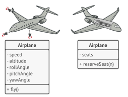
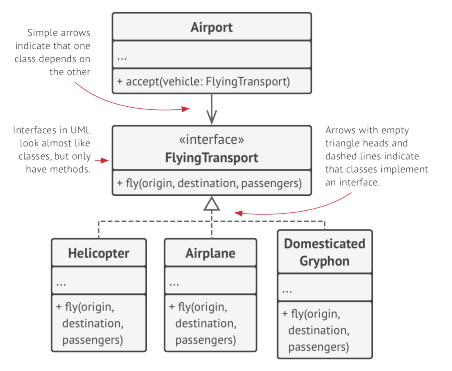
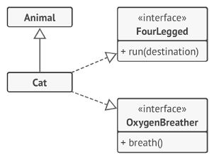

# OOP's pilars
* Abstraction: **Model** of attributes and behaviors of real objects **into in a specific context**: e.g: Airplane class could probably exist in both a flight simulator and a flight booking application.

  
 
* Encapsulation: Ability of an object to **hide parts of its state and behaviors** from other objects, **exposing only a limited interface** to the rest of the program.
 e.g - **The car interface**: To start a car engine, you only need to turn a key or press a
button. You don’t need to connect wires under the hood, and initiate the power cycle. These details are hidden under the hood of the
car. You have only a simple interface: a start switch, a steering
wheel and some pedals. This illustrates how each object has
an interface—a public part of an object, open to interactions
with other objects.
 e.g - **The airport**: Imagine that you have a <code>FlyingTransport</code> interface with a method <code>fly(origin, destination, passengers)</code>. When you design an air transporation simulator, you could restrict the <code>Airport</code> class to work only with objects that implement the <code>FlyingTransport</code> interface.

  

  Implementation of the <code>fly</code> method could be changed in theese classses in any way you want.
* Inheritance: Ability to **build** new **classes on top of existing** ones.
As consequence, subclasses have the same interface as their parent. A class can have multiple interfaces.

    

* Polymorphism: Habilidad de un programa de **detectar la clase de un objeto**, y **llamar su implementación**, aun cuando esta clase es **desconocida en el contexto** actual.

  Polymorphism is achieved through **inheritance** and **method overriding**.

  e.g - **Vehicles engine**: Imagine a Vehicle **base class and derived classes** such as <code>Car</code>, <code>Boat</code>, and <code>Airplane</code>. Each derived class can have a method called <code>startEngine</code> (*method overriding*) to start the corresponding engine. With polymorphism, you can have an **array of Vehicle objects** and call the <code>startEngine</code> method on each element, **irrespective of the actual derived class** associated with it: Program's ability to detect each element's class and call its implementation is polymorphism.